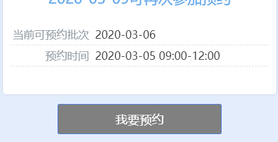
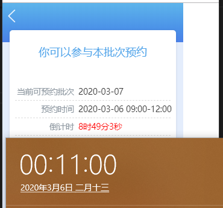
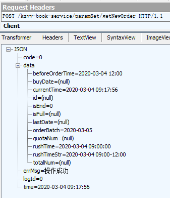

## 序言

> 利益是人类行动的一切动力。
>
> *——霍尔巴赫*

最近疫情形势紧张，口罩供给一直跟不上需求。我所在的城市政府为了让大家都有口罩用，也和其他大城市一样推出了口罩预约系统，所有人每天早上 9 点准时登录网站，拼手速点预约按钮，谁够快谁就能预约到口罩。



一开始我也没注意过这个系统，毕竟一个市的人去抢，一般都抢不过……然而后来某个亲戚抢口罩的时候注意到了系统的一个小问题，从而人手抢到了口罩。于是，我开始着手研究这个预约系统。

## 1. 利用倒计时读秒 Bug 加快进入系统

登录系统后首先发现的一个问题是，倒计时读秒似乎比真实情况慢很多：



平均情况下 1 分钟的读秒，这个网页要多花 2~3 秒钟。虽然可以通过刷新网页的方式重置计时，然而网站到最后一两分钟的时候访问人数又爆炸多，最后一分钟刷新网页几乎不可能……

虽然不知道这个问题是不是故意的（谁这么无聊啊），不过这个问题的严重程度，就连程序猿都要另外实现一个接口，每隔一段时间获取服务器时间重置一下计时。

由此可以判断，网页载入的时候必定要获取一次服务器时间，用来计算倒计时剩余时间。再一看前端用了 `Vue` 这样前后端分离的框架，那么只需要用一个抓包工具，修改服务器的响应时间，让前端得到错误的服务器时间，就能**比其他正常读秒的人更快看到预约按钮了**。

这里我用了 Fiddler，一个大名鼎鼎的 Windows 系统代（zhua）理（bao）工具。预约网站本身连 `https` 都没有，甚至连配证书的功夫都省了，直接上抓包日志：



可以判断出 `time` 应该是后端本身封装的响应属性，而 `data.currentTime` 应该就是前端读取的服务器时间了，修改这个值就够了。

在 Fiddler 点击 `Rules -> Customize Rules...`，在打开的 Fiddler ScriptEditor 中查找函数 `OnBeforeResponse`，Fiddler 就是在返回响应前调用了这个函数，我们利用提供的 `oSession` 变量修改响应包中的 `data.currentTime` 就好了。核心代码如下：

```c#
var modTime = DateTime.Now.AddMinutes(20);
var timeStr = modTime.ToString("yyyy-MM-dd HH:mm:ss");
obj.JSONObject["time"] = timeStr;
if (oSession.uriContains("getNewOrder")) {
	obj.JSONObject["data"]["currentTime"] = timeStr;
}
if (oSession.uriContains("serverTime")) {
	obj.JSONObject["data"] = timeStr;
}
```

这里我保险起见，连 `time` 也一起修改了。而修改 `data` 本身是因为过一段时间后，前端会向后端请求服务器时间、重置倒计时，因此针对 URI 中含有 `serverTime` 的响应也进行了修改。有意思的地方是，Fiddler 这个 Rule 脚本的语言是 `C#`，我一开始并不知道，为了一句简单的 `DateTime.Now` 还查了好久的官方文档，到处碰壁 🤦‍

现在就能比正常人更快看到预约按钮了（如下图）！但是仅仅靠这个还不够，因为提早看到按钮不代表能早于开抢时间进行预约，更不代表你能比其他人更准时地点那个按钮……


## 2. 油猴注入 JS 脚本实现自动点击

既然人手难以保证准时准点按下预约按钮，下一步就是考虑怎么让电脑自动按按钮了。

由于绝大多数情况下，服务器时间和本地时间并不一致，不能简单地按照本地时间进行操作。然而要和服务器校准时间也很难……于是决定采用最暴力的方法，从某个时间开始，每隔一小段时间就按一次按钮。

由于按按钮只是触发了按钮对应 DOM 的 `click` 事件，只需要原生 JS 脚本就能做到。再利用 `setTimeout` 模拟倒计时（比网页自己实现的那个要准），就可以做到在某个时刻按下按钮了：

```javascript
// Set the target time
let target = new Date();
target.setHours(8);
target.setMinutes(59);
target.setSeconds(59);
target.setMilliseconds(500);
console.log('The target time is: ' + target.format('yyyy-MM-dd hh:mm:ss.S'));

const countDown = target.getTime() - new Date().getTime();
console.log('countDown:', countDown);

setTimeout(function () {
	const interval = setInterval(function () {
		console.log('click');
		document.getElementById('hq_btn').click();
	}, 300);
	setTimeout(function () {
		clearInterval(interval);
		console.log('Done');
	}, 2500);
}, countDown);
```
